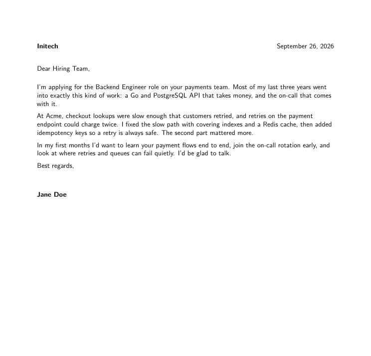
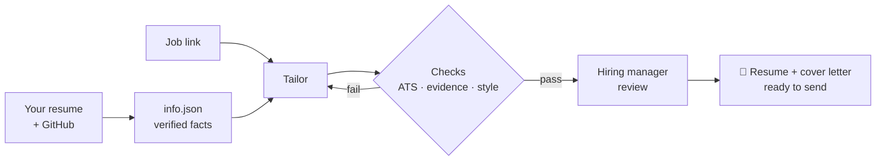

<div align="center">

# resume-forge

### Tailored resumes that can't lie.

Paste a job link. Get a resume, a cover letter, a fit score, a hiring manager's review, and interview prep.<br>
All of it comes from facts you've verified. Nothing is made up.

[](https://claude.com/claude-code)
[](#why-its-different)
[](LICENSE)
[](https://github.com/Omarabdul3ziz/resume-forge)

 

</div>

<!-- demo GIF goes here:  -->

```
/resume-forge:tailor https://initech.com/jobs/backend-engineer

Ready: ~/resume-forge-data/applications/2026-09-26-initech/Jane-Doe-Resume-Initech.pdf  (+ cover.pdf)
FIT: 91% (5 match, 1 partial, 0 gap of 6 must-haves)
Reviewer: would interview. Payments experience is the strongest signal.
Top gaps: payments (partial)  → answers in advices.md
```

## Spot the difference

Most AI resumes read the same: inflated, full of buzzwords, and easy to spot. Recruiters skim past them and ATS filters drop them.

| ❌ Typical AI resume | ✅ resume-forge |
|---|---|
| Spearheaded a robust caching strategy, significantly improving performance | Cut p95 latency from 800ms to 120ms by rewriting order lookups with covering indexes and a Redis read-through cache |
| Leveraged cutting-edge technologies to ensure seamless payment reliability | Added idempotency keys to the payment endpoint so client retries can't double-charge |
| Responsible for driving asynchronous processing initiatives | Moved invoice generation off the request path into a RabbitMQ message queue worker with retries and a dead-letter queue |

Concrete work, real numbers, no fluff. Every line on the right holds up when an interviewer asks "walk me through that".

## Why it's different

- 🔒 **Every number has proof.** "800ms to 120ms" only goes on the resume if you've linked a PR, dashboard, or release that shows it. Otherwise it's blocked.
- 🤖 **Built to pass ATS filters.** It reads the finished PDF the way an ATS parser does. It checks for your contact info, the standard headings, and the job's exact wording for each skill you really have.
- 🚫 **No AI slop.** Buzzwords like "spearheaded" and "leveraged" are banned, along with em-dashes in bullets and bloated bullets. Resumes stay at 2 pages or less.
- 👀 **A second opinion before you send.** A skeptical "hiring manager" agent reviews each application against the job and flags anything weak.
- 🎯 **Honest gaps, not hidden ones.** Requirements you don't meet aren't covered up. You get honest answers to prepare for the interview instead.

## How it works



## Quickstart ⚡

You need [Claude Code](https://claude.com/claude-code). Inside Claude Code, run:

```
/plugin marketplace add Omarabdul3ziz/resume-forge
/plugin install resume-forge@resume-forge
```

Then:

```
/resume-forge:tailor https://company.com/jobs/123
```

The first run asks for your current resume and sets everything up. If a tool like `tectonic`, `poppler`, or `jq` is missing, it gives you the one-line install command for your OS.

Want changes? Just say so in the same chat: *"make it one page"*, *"lead with the payments work"*.

## What you get for each job 📦

| File | What it's for |
|---|---|
| `Jane-Doe-Resume-Initech.pdf` | The resume to upload, with a name recruiters recognize |
| `cover.pdf` | A 3-paragraph cover letter with no flattery |
| `keywords.txt` | Each must-have in the job, judged match, partial, or gap, with the reasoning |
| `review.md` | The hiring manager's verdict |
| `advices.md` | How to answer your gaps, likely questions, and stories to prepare |
| `resume.txt` | Plain text for Workday-style forms that make you re-type everything |

No job yet? `/resume-forge:tailor master backend engineer` makes a general resume for a role, for job fairs, referrals, and recruiters who reach out first.

## FAQ

**Does it apply for me?** No. It writes, you read, you send.

**Where does my data go?** It stays on your machine in `~/resume-forge-data/`. The plugin never stores it.

**Can I change the look or the writing rules?** Yes. See the [manual](docs/MANUAL.md#customize).

**What does a finished application look like?** There's a full sample for a fake candidate (Jane Doe) in [docs/sample](docs/sample).

📖 **[Read the manual](docs/MANUAL.md)** for every command, how evidence works, and troubleshooting.

---

<div align="center">

If resume-forge got you an interview, a ⭐ helps others find it.<br>
MIT licensed.

</div>
