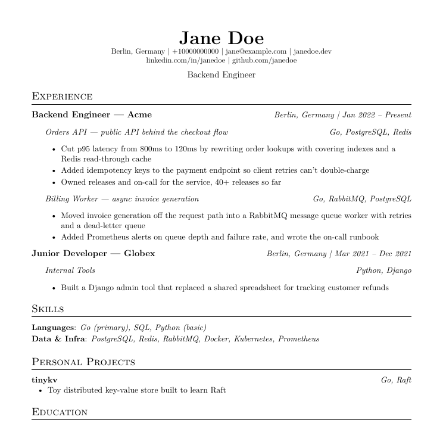

# resume-forge

**Tailored resumes that can't lie.**

Paste a job link. Get a resume and cover letter written for that job, a fit score, a hiring manager's review, and interview prep. Everything comes from facts you've verified, and nothing is made up.

Most AI resumes read the same: inflated, full of buzzwords, and easy to spot. Recruiters skim past them and ATS filters drop them. resume-forge writes like an engineer talking to a peer, and it won't build a resume that breaks its rules.



```
Ready: ~/resume-forge-data/applications/2026-09-26-acme/Jane-Doe-Resume-Acme.pdf  (+ cover.pdf)
FIT: 79% (8 match, 2 partial, 2 gap of 12 must-haves)
Reviewer: would interview. Lead with the payments work.
Top gaps: Kubernetes, AWS  → answers in advices.md
```

## Why it's different

- **Every number has proof.** "Cut latency 85%" only goes on the resume if you've linked a PR, dashboard, or release that shows it. Otherwise it's blocked.
- **Built to pass ATS filters.** It reads the finished PDF the way an ATS parser does. It checks for your contact info, the standard headings, and the job's exact wording for each skill you really have.
- **No AI slop.** Buzzwords like "spearheaded" and "leveraged" are banned, along with em-dashes in bullets and bloated bullets. Resumes stay at 2 pages or less.
- **A second opinion before you send.** A skeptical "hiring manager" agent reviews each application against the job and flags anything weak.
- **Honest gaps, not hidden ones.** Requirements you don't meet aren't covered up. You get honest answers to prepare for the interview instead.

## Quickstart

You need [Claude Code](https://claude.com/claude-code). Inside Claude Code, run:

```
/plugin marketplace add Omarabdul3ziz/resume-forge
/plugin install resume-forge@resume-forge
```

Then:

```
/resume-forge:tailor https://company.com/jobs/123
```

The first run asks for your current resume and sets everything up. If a tool like `tectonic`, `poppler`, or `jq` is missing, it gives you the one-line install command for your OS.

Want changes? Just say so in the same chat: *"make it one page"*, *"lead with the payments work"*.

## What you get for each job

| File | What it's for |
|---|---|
| `Jane-Doe-Resume-Acme.pdf` | The resume to upload, with a name recruiters recognize |
| `cover.pdf` | A 3-paragraph cover letter with no flattery |
| `keywords.txt` | Each must-have in the job, judged match, partial, or gap, with the reasoning |
| `review.md` | The hiring manager's verdict |
| `advices.md` | How to answer your gaps, likely questions, and stories to prepare |
| `resume.txt` | Plain text for Workday-style forms that make you re-type everything |

No job yet? `/resume-forge:tailor master backend engineer` makes a general resume for a role, for job fairs, referrals, and recruiters who reach out first.

## FAQ

**Does it apply for me?** No. It writes, you read, you send.

**Where does my data go?** It stays on your machine in `~/resume-forge-data/`. The plugin never stores it.

**Can I change the look or the writing rules?** Yes. See the [manual](docs/MANUAL.md#customize).

**What does a finished application look like?** There's a full sample for a fake candidate in [docs/sample](docs/sample).

📖 **[Read the manual](docs/MANUAL.md)** for every command, how evidence works, and troubleshooting.

## License

MIT
